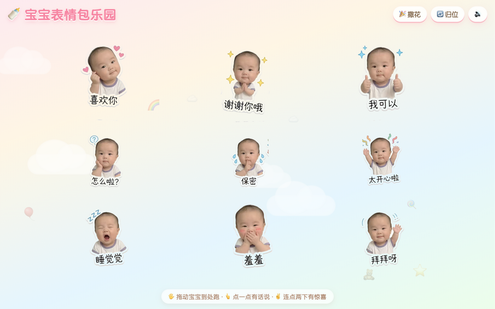
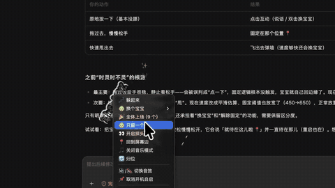
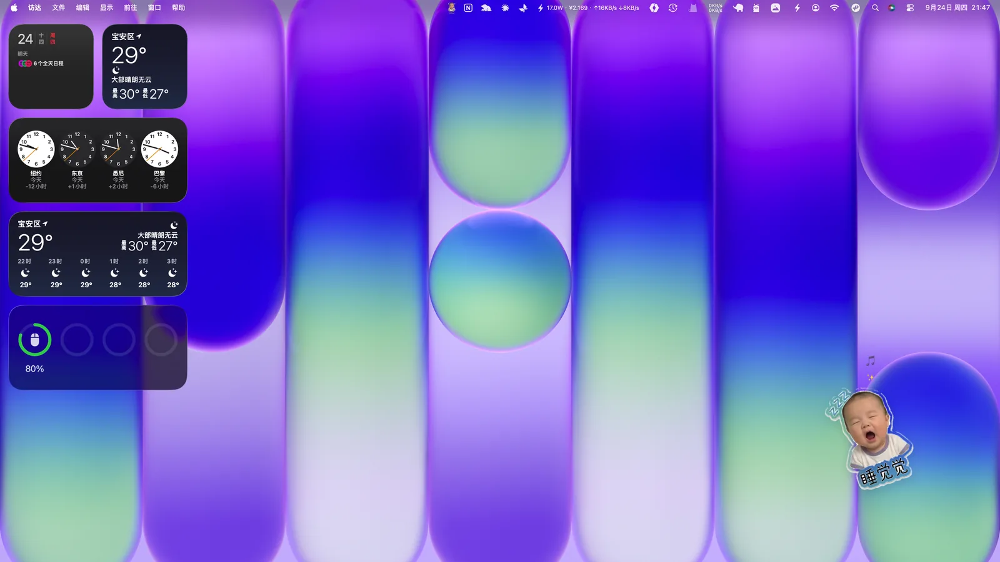
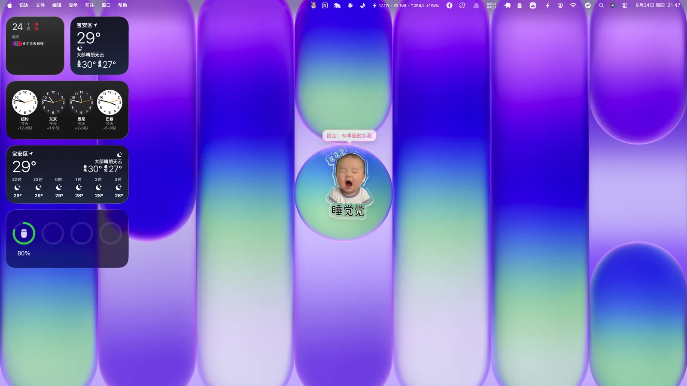
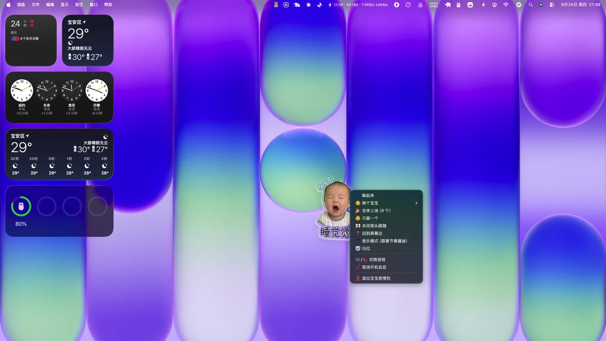

# 🍼 Baby Meme Desktop Pet / 宝宝表情包桌面宠物

<div align="center">

**Turn your baby's meme stickers into a living desktop companion.**
**把宝宝的 9 宫格表情包，变成住在你电脑里的桌面宠物。**

[](https://awesomeyang.com/baby-stickers/)




</div>

---

把家里宝宝的 9 宫格表情包抠成 9 张透明底贴纸，做成了两种形态的"电子分身"：

| 形态 | 技术 | 说明 |
|---|---|---|
| 🌐 **网页版** | 纯原生 HTML/JS，单文件零依赖 | 打开即玩，手机浏览器也支持 |
| 🖥️ **Mac 桌面版** | Electron | 透明置顶悬浮层，常驻屏幕边缘，开机自启 |

## ✨ 特性

**共通**
- 🖐️ **真实物理拖拽**：抓住宝宝到处甩，松手带惯性飞行、撞墙反弹，再慢悠悠飘回家
- 👆 **气泡台词**：点一下跳一跳、冒气泡说话，9 个宝宝各有专属台词
- ✌️ **撒星星**：连点两下触发星星特效
- 🧸 **挂机小动作**：闲置时自己蹦跶、扭一扭、头顶冒小表情（「睡觉觉」只会冒 💤）
- 🔊 **合成音效**：WebAudio 现场合成，零音频素材，可静音

**Mac 桌面版额外玩法**
- 👀 **探头跟随**：宝宝贴在屏幕边缘只露半张脸，跟着鼠标高度移动；靠近就好奇地探出来打招呼
- 📍 **轻放固定**：拖到任意位置轻轻松手就待在那儿，重启也记住位置；用力甩出去则恢复飞天弹墙
- 🥌 **甩飞换娃**：甩向屏幕边缘——这个宝宝飞出去，下一个从对面飞进来
- 🖱️ **滚轮 / 双击换宝宝**，右键菜单可指定任意一个
- 🎉 **全体上场**：9 个宝宝在桌面排成 3×3 阵型一起蹦跶
- 💤 **睡觉规矩**：每天 23:00 后自动进入睡觉模式，只留「睡觉觉」陪你，早上 7:00 自动睡醒
- 🎵 **音乐模式**：一键开启，宝宝跟着节奏在屏幕上蹦跳滚动、落地打节拍冒音符
- 💤 **躲起来 / 一键召回**：完全隐藏不挡操作，屏幕角落出现召唤按钮，点一下就回来
- 🚀 **开机自启**：菜单里勾选即可

## 📸 桌面版预览

**🎵 一句话玩法演示** —— 右键开启音乐模式，9 个宝宝集体蹦迪：



▶️ [观看完整演示视频（1′45″）](docs/desktop-demo.mp4) · [X 上的原帖](https://x.com/AwesomeYang_com/status/2100932629080191158)

**👀 探头跟随** —— 贴着屏幕边缘，跟着鼠标上下探出小脑袋



**📍 轻放固定** —— 拖到哪里，就住在哪里



**📋 右键菜单** —— 换宝宝 / 全体上场 / 音乐模式 / 睡觉规矩，一应俱全



## 🌐 在线体验

网页版已部署在我的博客：**[awesomeyang.com/baby-stickers](https://awesomeyang.com/baby-stickers/)**

也可以直接本地打开 `index.html`，无需任何服务。

## 🚀 快速开始

### 网页版

```bash
# 直接双击 index.html 用浏览器打开，或起个本地服务：
python3 -m http.server 8000
# 访问 http://localhost:8000
```

### Mac 桌面版

要求：Node.js ≥ 18

```bash
cd desktop
npm install          # 安装 Electron
npm start            # 直接运行
```

打包成独立 `.app` 并安装到 `/Applications`：

```bash
./build-app.sh       # 一键打包安装（自带 Electron，可整个拷给别人）
```

## 🍼 换成你家宝宝

1. 准备一张 3×3 的九宫格表情包照片（白底效果最佳）
2. 一键切分抠图（需要 `pip3 install pillow numpy`）：

   ```bash
   python3 tools/split_stickers.py 九宫格.jpg -o stickers/
   ```

3. 把输出的 `baby-1.png ~ baby-9.png` 覆盖到 `stickers/`（网页版）和 `desktop/stickers/`（桌面版）
4. 想改台词？编辑 `index.html` 或 `desktop/overlay.html` 顶部的 `BABIES` 数组即可

> 贴纸按「从左到右、从上到下」顺序对应 9 个角色，台词在 `BABIES` 数组里一一对应。

## 🧱 项目结构

```
baby-stickers/
├── index.html              # 网页版（单文件，含全部样式与逻辑）
├── stickers/               # 网页版贴纸（透明底 PNG ×9）
├── desktop/                # Mac 桌面版（Electron）
│   ├── main.js             # 主进程：透明置顶窗口 / 鼠标穿透 / 托盘与菜单 / 召回按钮
│   ├── preload.js          # contextBridge 安全桥接
│   ├── overlay.html        # 桌面浮层页面（物理引擎 / 探头跟随 / 音乐模式）
│   ├── summon.html         # 「躲起来」时的召回按钮
│   ├── build-app.sh        # 一键打包安装脚本
│   └── stickers/           # 桌面版贴纸副本
├── tools/
│   └── split_stickers.py   # 九宫格切分抠图工具（洪水填充去背景）
└── docs/                   # 截图
```

## ⚙️ 实现要点

- **抠图**：从图片边缘洪水填充近白色背景（保留贴纸白边与装饰元素），1px 羽化 + 自动裁切
- **物理**：弹簧回家 + 速度积分 + 墙壁反弹的简易引擎，拖拽用 Pointer Events（兼容触屏）
- **鼠标穿透**：`win.setIgnoreMouseEvents(true, { forward: true })`，页面根据悬停目标动态切换，桌面宠物不挡任何操作
- **音效**：WebAudio 振荡器实时合成，无任何素材文件

## 🔒 隐私说明

仓库中的贴纸为作者自家宝宝的照片，已征得家人同意分享；`assets/` 目录（原图）与个人草稿**不在仓库内**。
如果你要用自己宝宝的照片做同款，建议按需选择公开或私有仓库。

## 📄 License

[MIT](LICENSE)
